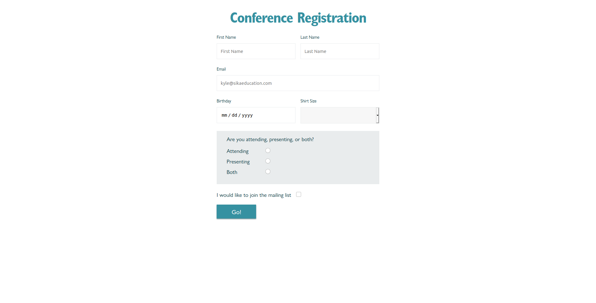

# Conference Registration

Refactor the HTML and CSS in `index.html` to use components and dynamically filter data based on search criteria.

* Your solution should have at least 5 components
* All fields are required except the mailing list
* You should implement validations for all fields
